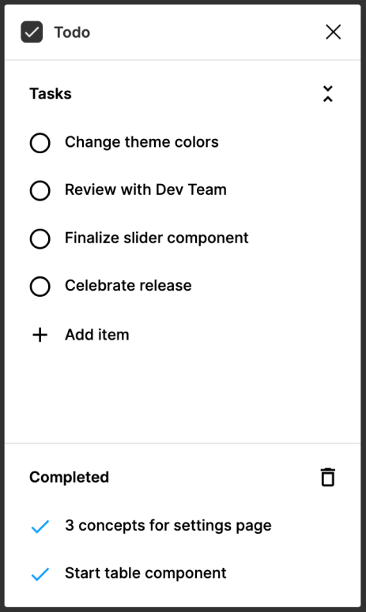

<h1 align="center">Todolist API with Clean Architecture</h1>

## 🧪 Technologies

This project was developed by using the following technologies:

* Typescript
* Editorconfig
* Eslint
* Vitest

## 🚀 How to use
```bash
  git clone https://github.com/gutemberg-jhonata/clean-arch-todolist.git
  cd clean-arch-todolist
  pnpm test
```
## 💻 About

This is a backend todolist project to pratice TDD and clean architecture.
The project was inspired by the following layout 👇

<p align="center">
  
</p>

## :memo: Licence

This project is under MIT license. See the [LICENSE](.github/LICENSE.md) file for more details.
